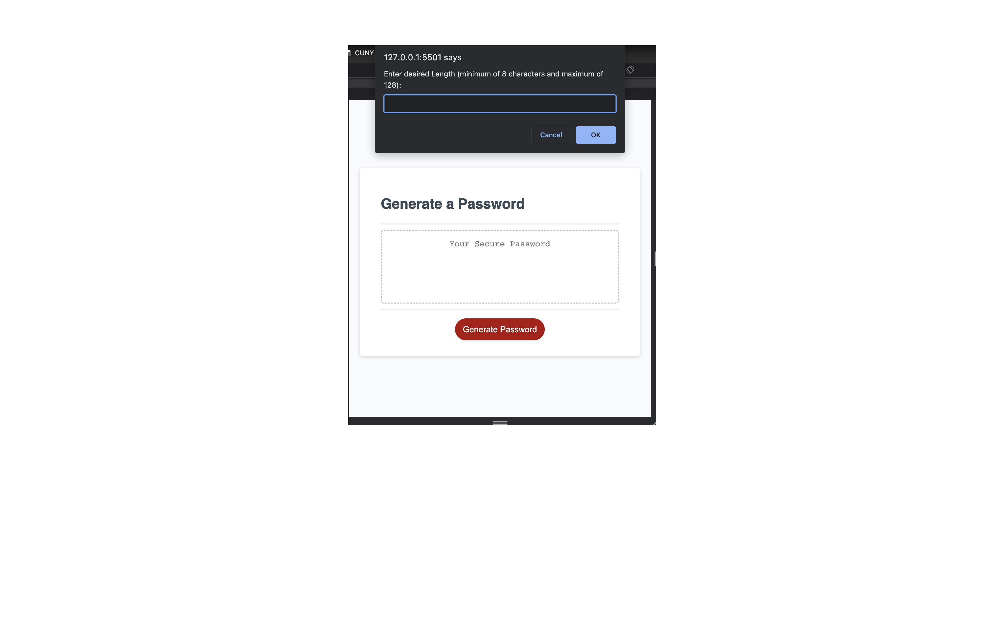
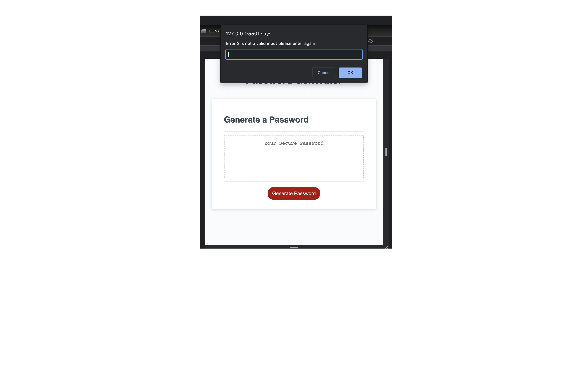
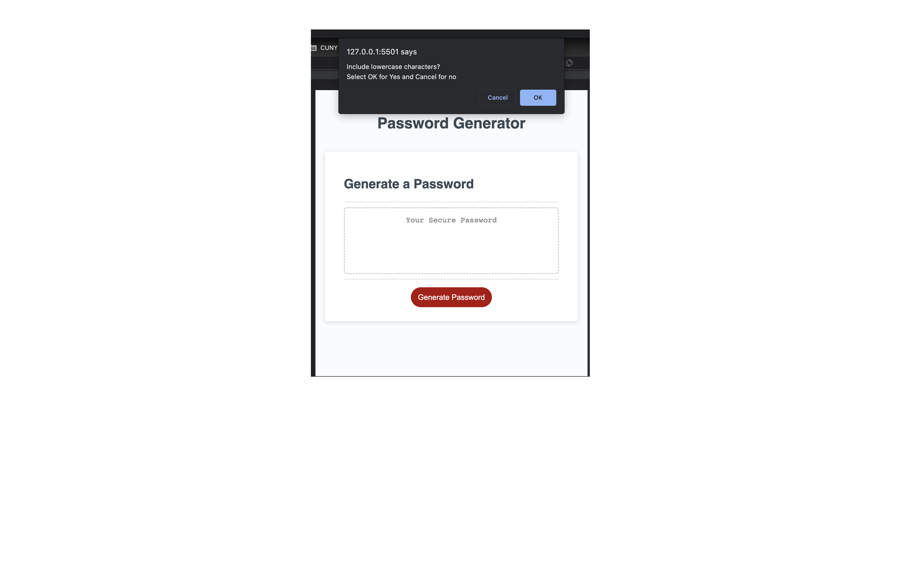
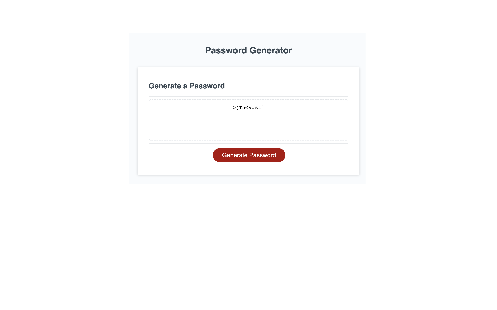

# Password Generator

## Table of contents
*[Introduction](#introduction)
*[Technologies](#technologies-used)
*[Usage](#usage)
*[License](#License)
*[Screenshots](#Screenshots)
*[Deployment](#Deployment)
*[Future](#Future)
*[Credits](#Credits)
*[Contact](#contact)

## Introduction
Ever needed to create a randomized password from 8 characters all the way up to 128 characters in the blink of an eye. Well now you can with this password generator which includes all charcaters, numerical, special, all you have to do is follow the prompt.

## Technologies Used
Javascript
CSS
HTML5

## Usage
If the user ever deems tha that would like a unique key or password for up to 128 characters, they can follow the promopt and get a randomized password within seconds

## Deployment
-[Github](https://github.com/ikorman12/PasswordGen)
-[Live-deployment](https://ikorman12.github.io/PasswordGen/)

## Screenshots

## Future
Reuse this project within future development as a linked asset in order to generate random id's or just simply decide on an new safe password.

## Credits
Igor Korman

## Contact
Feel free to contact me at [ikorman12@gmail.com](ikorman12@gmail.com) or message me on [Github]](https://github.com/ikorman12)

